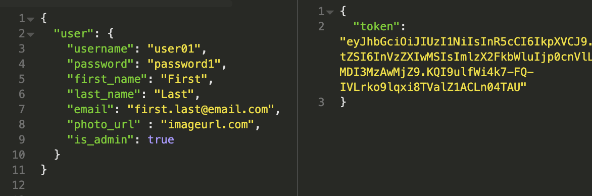
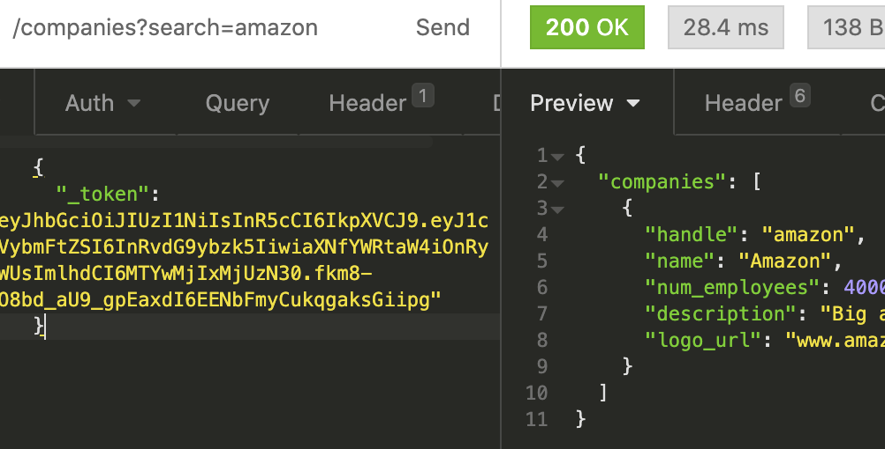

# jobly
JSON API application using NodeJS/Express with resources on companies and jobs. 

## Language/Frameworks/Libraries used
* NodeJS/Express
* PostgreSQL
* js library _pg_ to establish low-level connection between app and database
* supertest for testing

## How to use API
In root directory, run the following command: `node server.js`
As with other RESTful APIs, it's helpful to use a platform like Postman or Insomnia to see test how the application responds to different requests. 

The company and job routes require user authentication. When you login or sign up, the app will return a token which you can then send along with your other requests.

Sample signup route:  

Get companies route with authentication:

Note that application depends the value of token to be stored in key `_token`. 

## Routes
### Companies
* `get` request to `baseurl/companies`: returns list of all companies. This route also accepts the following query parameters to filter results: `search`, `min_employees` and `max_employees`
For example, the following get request can expect a resource of all companies with the word apple somewhere in the name and and that have at least 2000 employees. `baseurl/companies?search=apple&min_employees=2000`
* `post` request to `baseurl/companies`: Adds a new company to database. Requires admin authorization.
*  `get` request to `baseurl/companies/<handle>` with handle being the company handle will receive a resource on all details for that company.
*  `update` and `delete` requests can be made to a specific company by following the following route: `baseurl/companies/<handle>` where the handle is the company's handle.  This route requires admin authorization. 

### Jobs
* `get` request to `baseurl/jobs`: returns list of all jobs in database. This route also accepts the following query params: `search`, `min_salary` and `max_salary`
* `post` request to `baseurl/jobs`: Adds a new job to database. Requires admin authorization.
*  `get` request to `baseurl/jobs/<id>` with id being the job id will receive a resource on all details for that id.
*  `update` and `delete` requests can be made to a specific job by following the following route: `baseurl/job/<id>` where the id is the job id.  This route requires admin authorization. 

## Testing
In root directory, run the following command:
`jest`

## Status: in development